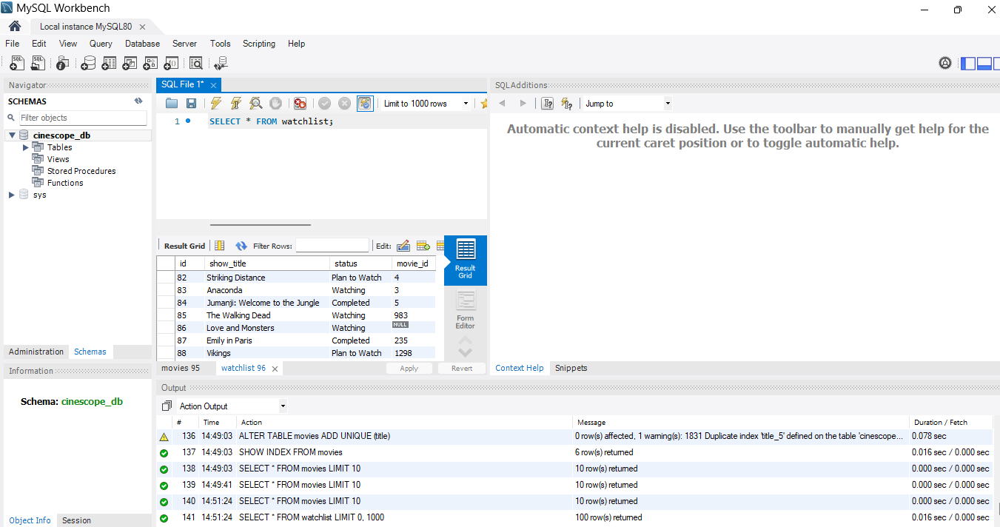
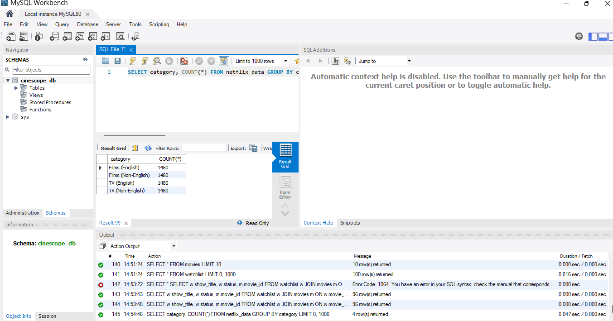
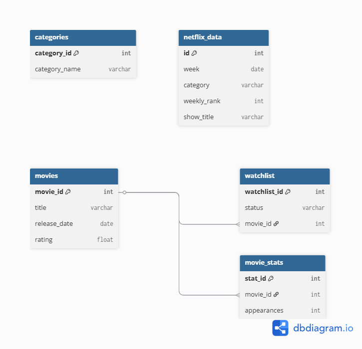

# CineScope – Real-Time Movie Analytics & Data Pipeline System


## 📌 Overview
CineScope is a real-time movie analytics and data pipeline system that fetches real-time data from the TMDB API, stores it in a MySQL database, and updates automatically on a daily basis. The system is designed to handle duplicates, maintain clean data, and support relational queries.

## 🎯 Purpose

This project was built to simulate a real-world data pipeline where movie data is continuously fetched, processed, and stored for analysis.

## 🚀 Features
- 🔄 Fetches real-time trending movies using TMDB API  
- ⏰ Automated daily database updates using Task Scheduler  
- 🗄️ MySQL database integration  
- 🔗 Relational database design with foreign key constraints  
- 📋 Watchlist feature to track movies   
- 🧠 SQL queries for data analysis (joins, aggregations, trends)  
- ⚠️ Error handling and retry mechanism for API failures

## 📸 Project Screenshots

### 🎬 Movies Table


### 📋 Watchlist Table


### 🔗 Watchlist with Movie IDs (Join)


### 📊 Data Analysis



## 🛠️ Tech Stack
- Python  
- MySQL  
- TMDB API  
- SQL  
- Windows Task Scheduler  


## 🗂️ Project Structure

```
cinescope/
│── src/
│ └── fetch_movies.py
│
│── sql/
│ └── schema.sql
│
│── assets/
│ ├── movies.png
│ ├── watchlist.png
│ ├── join.png
│ ├── analytics.png
│ └── er_diagram.png
│
│── requirements.txt
│── README.md
│── .gitignore
```


## ⚙️ Setup Instructions
1. Clone the repository  
2. Install dependencies:  pip install -r requirements.txt
3. Set your API key using environment variables:
   export TMDB_API_KEY=your_api_key
4. Run the script:
   python src/fetch_movies.py

Note: API key is stored securely using environment variables.

## ⏰ Automation

The script is scheduled using Windows Task Scheduler to run daily and keep the database updated automatically.

## ▶️ Sample Run Output

```
Movies inserted successfully!
Already exists: Avatar
Already exists: Jumanji
```

### 📊 Watchlist with Movie Mapping

## 📊 Database Design
- Movies table stores movie details  
- Watchlist table stores user-tracked content  
- Foreign key relationship ensures data consistency

## 🔄 Data Flow

1. Python script fetches trending movies from TMDB API  
2. Data is processed and duplicates are handled  
3. Clean data is stored in MySQL database  
4. Watchlist is linked using foreign keys  
5. SQL queries generate insights  
6. Task Scheduler automates daily execution  

## 🗺️ ER Diagram

This diagram represents the relational structure of the system, including core entities like movies, watchlist, and analytics tables.



*Note: The ER diagram represents an extended scalable design beyond the current implementation.*

## 🔥 Key Highlights
- Built a real-time data pipeline integrating API + database  
- Implemented duplicate handling for clean data storage  
- Designed relational schema with meaningful queries  
- Automated system to simulate real-world data updates  


## 📌 Future Improvements
- Add web interface for user interaction  
- Visual dashboard for analytics  
- Store more detailed movie metadata

## ⚡ Challenges Faced
- Handling API connection errors and retries  
- Preventing duplicate entries in database  
- Mapping inconsistent movie titles between datasets  

## 🧠 Learnings
- Implemented real-time API data fetching using Python  
- Designed relational database with foreign key constraints  
- Performed SQL joins and aggregation queries  
- Built automated data pipeline using Task Scheduler  
- Handled API failures and ensured data consistency


## 👩‍💻 Author
Pooja Patel
